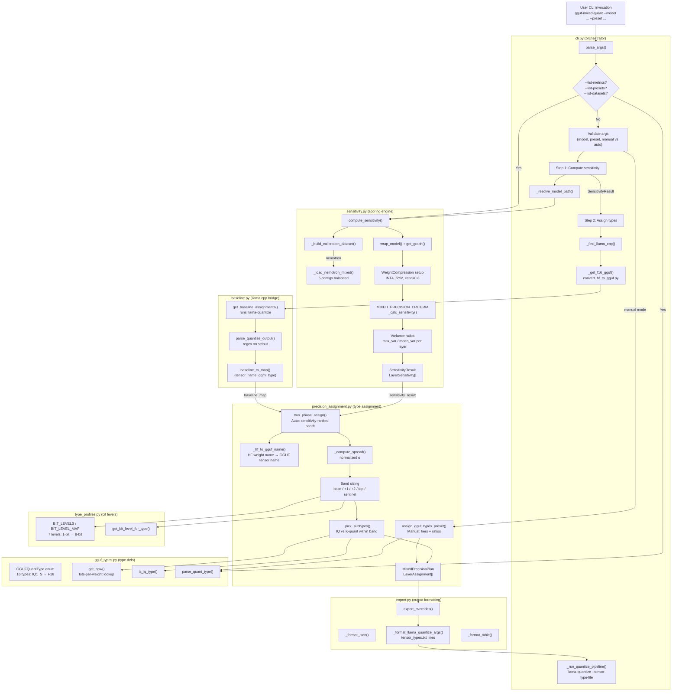

# Architecture: Code Flow Map

```mermaid
flowchart TD
    USER["User CLI invocation\ngguf-mixed-quant --model ... --preset ..."]

    subgraph cli.py["cli.py (orchestrator)"]
        PARSE["parse_args()"]
        INFO{"--list-metrics?\n--list-presets?\n--list-datasets?"}
        VALIDATE["Validate args\n(model, preset, manual vs auto)"]
        STEP1["Step 1: Compute sensitivity"]
        STEP2["Step 2: Assign types"]
        RESOLVE["_resolve_model_path()"]
        FINDLLAMA["_find_llama_cpp()"]
        GETF16["_get_f16_gguf()\nconvert_hf_to_gguf.py"]
        PIPELINE["_run_quantize_pipeline()\nllama-quantize --tensor-type-file"]
    end

    subgraph sensitivity.py["sensitivity.py (scoring engine)"]
        COMPUTE["compute_sensitivity()"]
        BUILDCAL["_build_calibration_dataset()"]
        NEMOTRON["_load_nemotron_mixed()\n5 configs balanced"]
        WRAPMODEL["wrap_model() + get_graph()"]
        WCCREATE["WeightCompression setup\nINT4_SYM, ratio=0.8"]
        CRITERION["MIXED_PRECISION_CRITERIA\n_calc_sensitivity()"]
        VARRATIO["Variance ratios\nmax_var / mean_var per layer"]
        RESULT["SensitivityResult\nLayerSensitivity[]"]
    end

    subgraph precision_assignment.py["precision_assignment.py (type assignment)"]
        direction TB
        MANUAL["assign_gguf_types_preset()\nManual: tiers + ratios"]
        AUTO["two_phase_assign()\nAuto: sensitivity-ranked bands"]
        HFTOGGUF["_hf_to_gguf_name()\nHF weight name → GGUF tensor name"]
        SPREAD["_compute_spread()\nnormalized σ"]
        BANDSIZE["Band sizing\nbase / +1 / +2 / top / sentinel"]
        SUBTYPES["_pick_subtypes()\nIQ vs K-quant within band"]
        PLAN["MixedPrecisionPlan\nLayerAssignment[]"]
    end

    subgraph baseline.py["baseline.py (llama.cpp bridge)"]
        GETBASE["get_baseline_assignments()\nruns llama-quantize"]
        PARSEOUT["parse_quantize_output()\nregex on stdout"]
        BASEMAP["baseline_to_map()\n{tensor_name: ggml_type}"]
    end

    subgraph export.py["export.py (output formatting)"]
        EXPORT["export_overrides()"]
        FMTJSON["_format_json()"]
        FMTARGS["_format_llama_quantize_args()\ntensor_types.txt lines"]
        FMTTABLE["_format_table()"]
    end

    subgraph gguf_types.py["gguf_types.py (type defs)"]
        ENUM["GGUFQuantType enum\n16 types: IQ1_S → F16"]
        BPW["get_bpw()\nbits-per-weight lookup"]
        ISIQ["is_iq_type()"]
        PARSETYPE["parse_quant_type()"]
    end

    subgraph type_profiles.py["type_profiles.py (bit levels)"]
        BITLEVELS["BIT_LEVELS / BIT_LEVEL_MAP\n7 levels: 1-bit → 8-bit"]
        GETBL["get_bit_level_for_type()"]
    end

    USER --> PARSE
    PARSE --> INFO
    INFO -->|Yes| COMPUTE & PARSETYPE
    INFO -->|No| VALIDATE
    VALIDATE --> STEP1
    STEP1 --> RESOLVE --> COMPUTE
    COMPUTE --> BUILDCAL
    BUILDCAL -->|nemotron| NEMOTRON
    COMPUTE --> WRAPMODEL --> WCCREATE --> CRITERION
    CRITERION --> VARRATIO --> RESULT

    STEP1 -->|SensitivityResult| STEP2
    VALIDATE -->|manual mode| MANUAL
    MANUAL --> PARSETYPE
    MANUAL --> PLAN

    STEP2 --> FINDLLAMA
    FINDLLAMA --> GETF16
    GETF16 --> GETBASE
    GETBASE --> PARSEOUT --> BASEMAP

    BASEMAP -->|baseline_map| AUTO
    RESULT -->|sensitivity_result| AUTO
    AUTO --> HFTOGGUF
    AUTO --> SPREAD --> BANDSIZE
    BANDSIZE --> SUBTYPES
    SUBTYPES --> PLAN
    SUBTYPES --> BPW & ISIQ
    BANDSIZE --> BITLEVELS & GETBL

    PLAN --> EXPORT
    EXPORT --> FMTARGS
    FMTARGS --> PIPELINE
```
